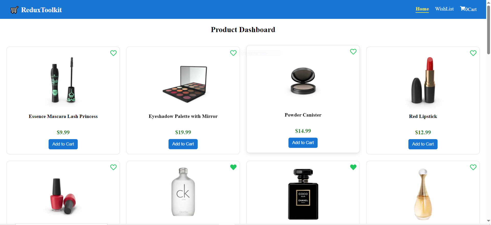
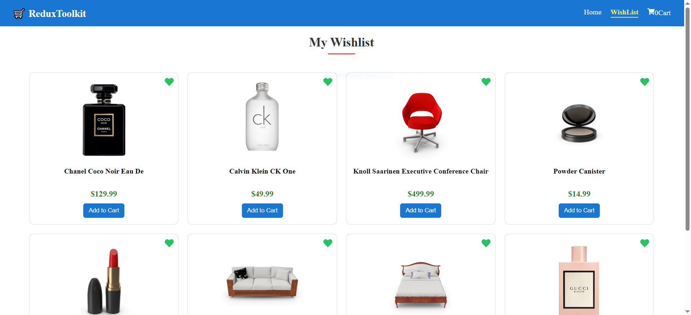
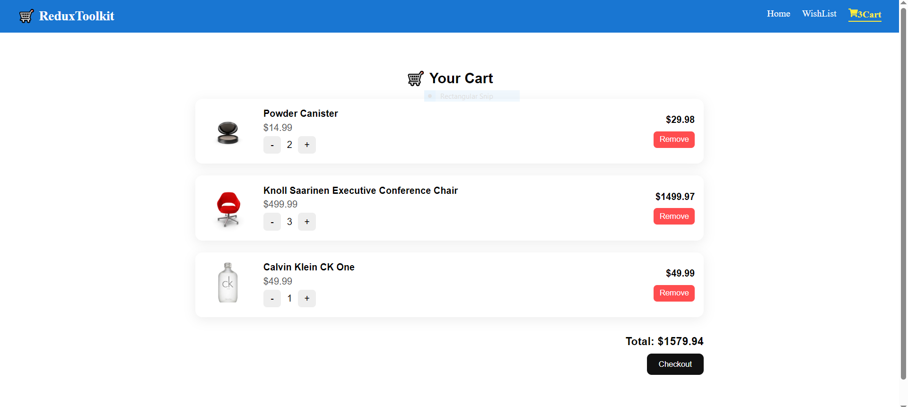

# 🛒 Shopping Cart App (React + Vite + Redux Toolkit)

A modern e-commerce frontend built using React (Vite), featuring product listing, wishlist, and cart functionality. The application demonstrates efficient state management using Redux Toolkit and asynchronous API handling using `createAsyncThunk`.

---

## 📸 Screenshots

### 🏠 Home / Product Listing

### ❤️ Wishlist Page

### 🛒 Cart Page

---

## 🚀 Features

- 📦 Product listing (fetched from API)
- ❤️ Wishlist management
- 🛒 Cart with dynamic total price calculation
- ⚡ Async API handling using Redux Toolkit (`createAsyncThunk`)
- 🔄 Centralized state management using Redux Toolkit
- 🔁 Add / Remove items from cart & wishlist

---

## 🧠 Tech Stack

- React (Vite)
- Redux Toolkit (RTK)
- JavaScript (ES6+)
- HTML5 & CSS3

---

## 📡 API

- Dummy data from: https://dummyjson.com/products

---

## 📁 Project Structure
